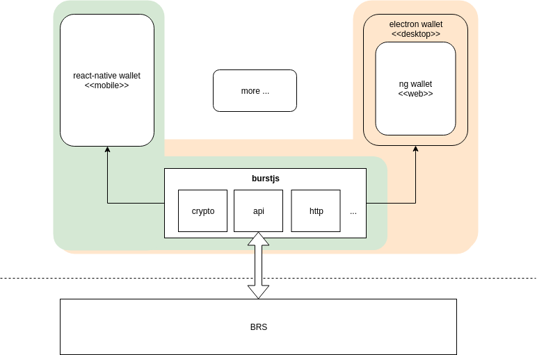

# Phoenix

## Project Status:

#### BurstJS 

 

 

---

## BURST Cross-Platform Wallet UI

According to [CIP-18](https://github.com/burst-apps-team/CIPs/blob/master/cip-0018.md) this is the new Cross-Platform Burst Wallet

Targeted platforms are

- Mac OS
- Linux
- Windows
- Android
- iOS

## Installation and Build

The project is structured per platform, and further build/installation instruction can be obtained from the `README.md` in their respective folders

### Required 
- [BurstJS Library](/lib/README.md)

### Optional
- [Web Wallet](/web/angular-wallet/README.md)
- [Desktop Wallet](/desktop/wallet/README.md)
- [Mobile Wallet](/mobile/README.md)
- [Development Scripts](/scripts/README.md)

