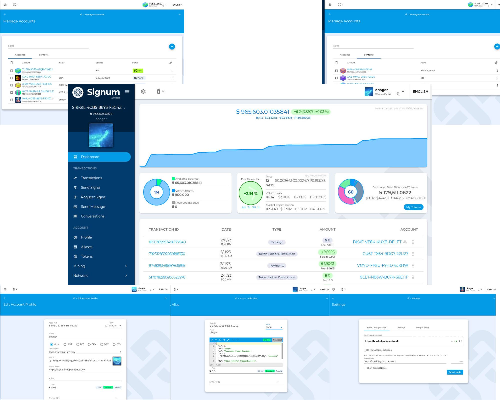

#  Phoenix Signum Wallet

Phoenix is an open source, cross-platform wallet for the Signum (former Burstcoin) blockchain. It's actually two applications: a mobile app, and a desktop/web app.

> More [screenshots](assets/1.5)

### Key features:

- Improved security - Private keys are encrypted with a hashed PIN, securing them in the event of data breach. That PIN is then used for locally signing transactions and decrypting messages. Passphrases are not stored locally, and never sent to the server.
- Multi-account support - Manage multiple accounts within your wallet.
- Contact List
- Offline account support - Watch an account without using the passphrase for maximum security.
- Cross-platform - Runs on all popular platforms without any additional software requirements.
- Different Dashboard Layouts - for different user profiles with Market Information and Interactive Balance History Diagram, Mining Informtion
- Powered by 

## Additional features:

- Multi-out support - Send and view Multi-out & Multi-out-same Payments
- QR Codes - View account QR codes and create custom QR codes for merchants/POS terminals.
- Deep Linking - Make your apps interact with Phoenix (see [here](./DEEPLINKING.md))- [SRC22 compatible](https://github.com/signum-network/SIPs/blob/master/SIP/sip-22.md)
- Support [SRC44](https://github.com/signum-network/SIPs/blob/master/SIP/sip-44.md) - Structured descriptor data for accounts and aliases 
- Alias support - View and register Signum Aliases, i.e. mutable on chain data
- Account Description - Edit your account profile
- Messages support - Send and receive encrypted and unencrypted messages.
- Mining Setup - Allows to set your reward recipient and commitment (PoC+)
- View peers, blocks, and transactions.
- Node Configuration - Select from a predefined list of nodes or use your own, or just let select automatically
- Account Activation - Once created an account, it gets activated by the network without the need of a faucet
- Update Notification - Be up-to-date with inbuilt update download
- Localized in 25 languages.
- Responsive UI

_Some features not available on mobile._

## Application Architecture

Phoenix is comprised of two main applications: a desktop application and a mobile application

The web application is built on Angular 8 and embedded into electron to be executable as desktop application.
The mobile application uses React Native to be available for Android and iOS. All these apps use the [SignumJS SDK](https://github.com/signum-network/signumjs)
to interact with the [Signum nodes](https://github.com/signum-network/signum-node).

## Installation and Build

The project is structured per platform, and further build/installation instruction can be obtained from the `README.md` in their respective folders.

### Pick A Platform

- [Web Wallet](/web/angular-wallet/README.md)
- [Desktop Wallet](/desktop/wallet/README.md)
- [Mobile Wallet](/mobile/README.md)

### See Also

- [Development Scripts](/scripts/README.md)
