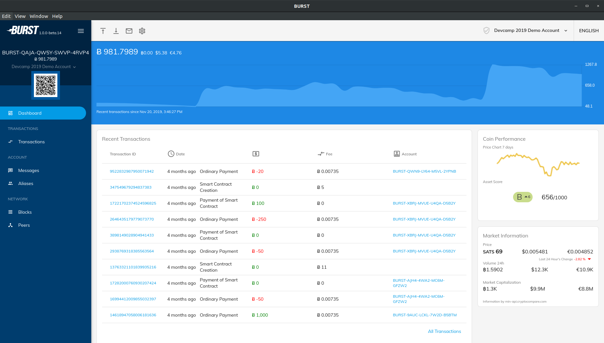
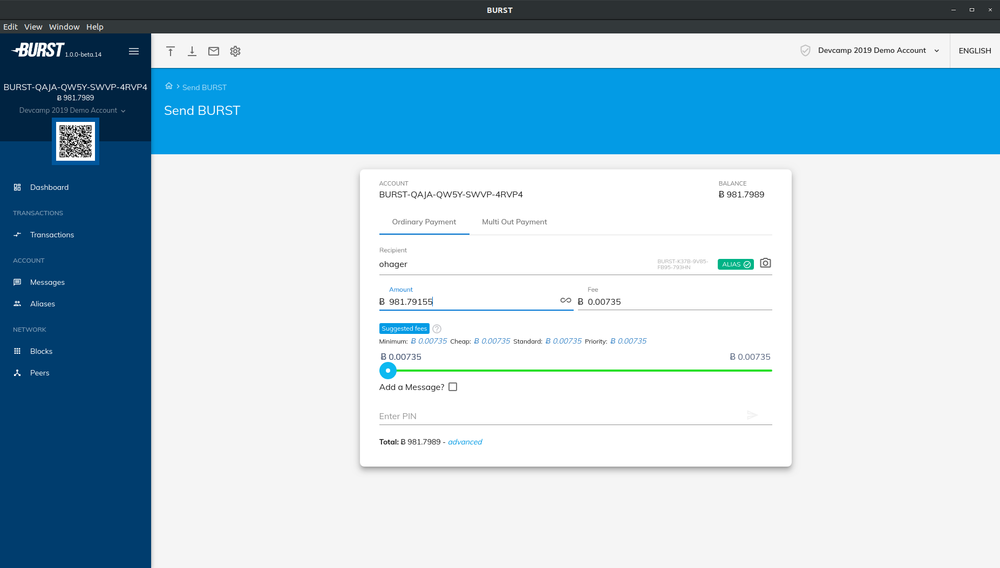
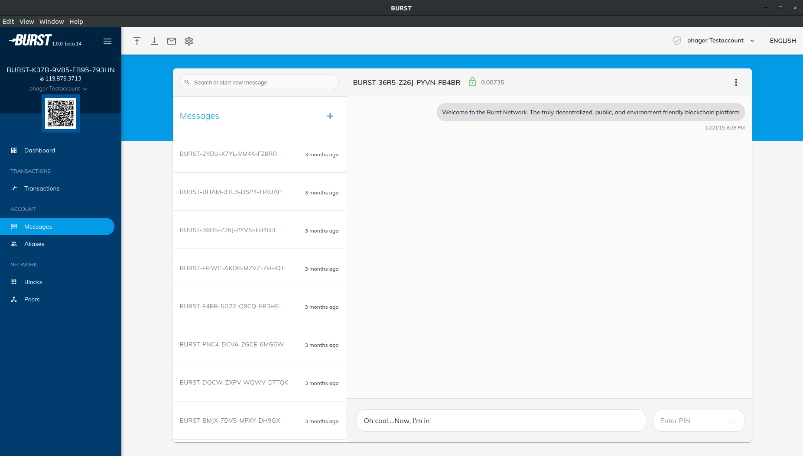
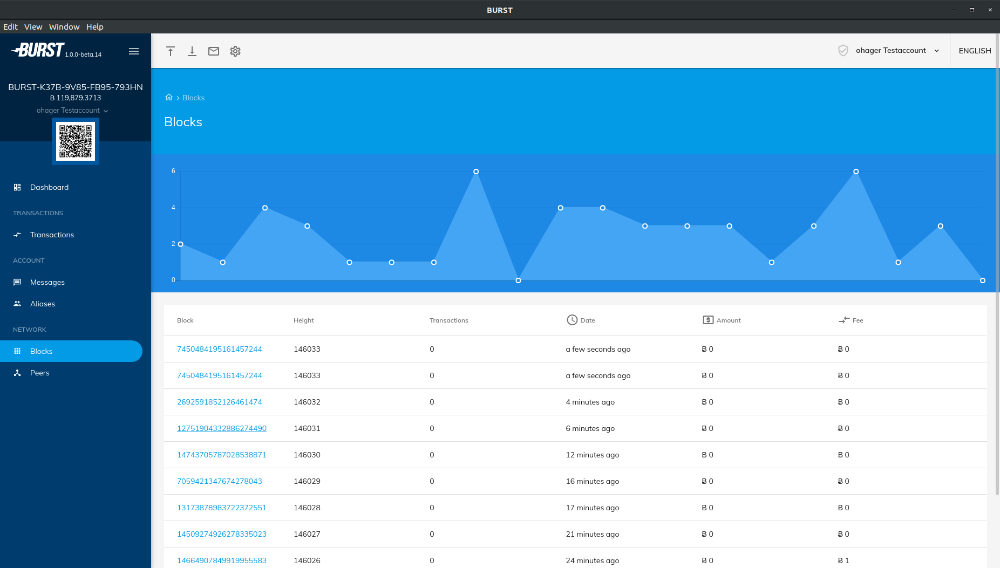
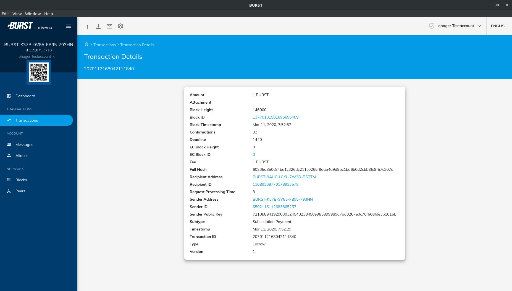
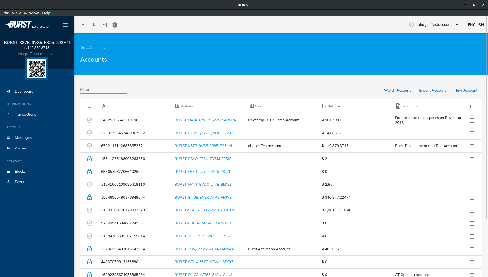
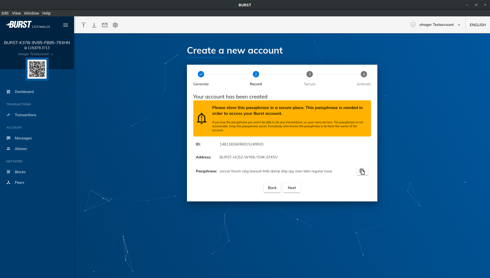
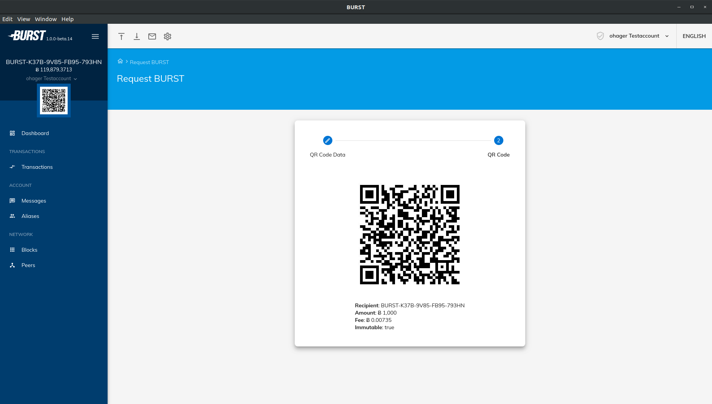

#  Phoenix Burst Wallet

  

## About

Phoenix is an open source, cross-platform wallet for the Signum (former Burstcoint) blockchain. It's actually two applications: a mobile app, and a desktop/web app. Oh, and [BurstJS](/lib/README.md) is in here too.

### Key features:
- Improved security - Private keys are encrypted with a hashed PIN, securing them in the event of data breach. That PIN is then used for locally signing transactions and decrypting messages. Passphrases are not stored locally, and never sent to the server. 
- Multi-account support - Manage multiple accounts within your wallet.
- Offline account support - Add an account using just a address for maximum security.
- Cross-platform - Runs on all popular platforms without any additional software requirements.
- Dashboard - with Market Information and Interactive Balance History Diagram.
- Powered by 

## Additional features:
- Multi-out support - Send and view Multi-out & Multi-out-same Payments (BRS 2.3.1 and above).
- QR Codes - View account QR codes and create custom QR codes for merchants/POS terminals.
- Deep Linking - Make your apps interact with Phoenix (see [here](./DEEPLINKING.md))
- Alias support - View and register BURST Aliases.
- Messages support - Send and receive encrypted and unencrypted messages.
- Mining Setup - Allows to set your reward recipient and commitment (Poc+)
- View peers, blocks, and transactions.
- Node Configuration - Select from a predefined list of nodes or use your own, or just let select automatically
- Update Notification - Be up-to-date with inbuilt update download
- Localized in 30 languages.
- Responsive UI

*Some features not available on mobile.*

## Screenshots

## Application Architecture

Phoenix is comprised of two main applications: a desktop application and a mobile application, each of which share a common library called BurstJS. 

## Installation and Build

The project is structured per platform, and further build/installation instruction can be obtained from the `README.md` in their respective folders.

### Archlinux

A package is available in [AUR](https://aur.archlinux.org/packages/phoenix/).

### Pick A Platform
- [Web Wallet](/web/angular-wallet/README.md)
- [Desktop Wallet](/desktop/wallet/README.md)
- [Mobile Wallet](/mobile/README.md)

### See Also
- [SignumJS Library](/lib/README.md)
- [Development Scripts](/scripts/README.md)

